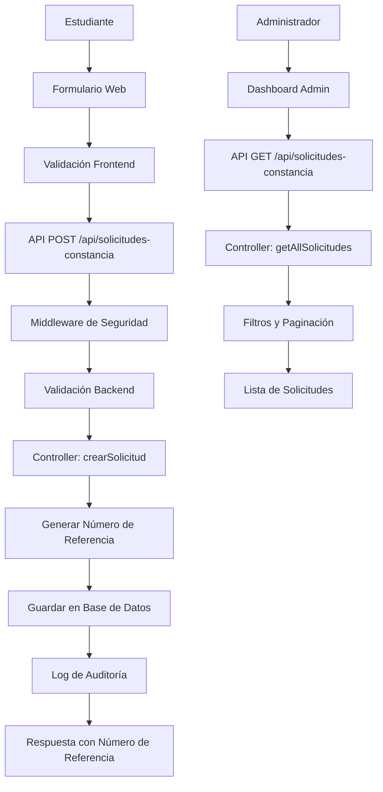

# 📋 MÓDULO DE SOLICITUDES DE CONSTANCIAS Y KARDEX

## 📖 Descripción General

El módulo de **Solicitudes de Constancias y Kardex** permite a los estudiantes de la UTTECAM realizar solicitudes en línea para obtener documentos académicos oficiales como:

- **Constancia de Estudios**: Documento que certifica que el estudiante está inscrito y cursando materias
- **Constancia de Trámite de Título**: Documento que certifica que el estudiante está en proceso de titulación
- **Kardex**: Historial académico completo del estudiante

## 🏗️ Arquitectura del Módulo

### Componentes Principales

```
src/
├── models/
│   └── Solicitud_Constancia.ts     # Modelo de datos con validaciones
├── controllers/
│   └── solicitudConstanciaController.ts  # Lógica de negocio
├── routes/
│   └── solicitudConstancia.ts       # Rutas y middleware de seguridad
└── sql/
    └── solicitudes_constancias_kardex.sql  # Script de base de datos
```

### Flujo de Datos



## 🛠️ Modelo de Datos

### Estructura de la Tabla: `solicitudes_constancias_kardex`

| Campo | Tipo | Descripción | Validaciones |
|-------|------|-------------|--------------|
| `id` | INTEGER | Identificador único | Primary Key, Auto-increment |
| `nombre` | VARCHAR(255) | Nombre completo del estudiante | Required, 2-255 chars, solo letras |
| `matricula` | VARCHAR(8) | Matrícula del estudiante | Required, exactamente 8 chars, alfanumérico, único |
| `correo` | VARCHAR(255) | Email del estudiante | Required, formato email válido |
| `telefono` | VARCHAR(10) | Teléfono del estudiante | Required, exactamente 10 dígitos |
| `carrera` | VARCHAR(255) | Nombre de la carrera | Required, 3-255 chars |
| `nivel` | ENUM | Nivel académico | Required, 'TSU' o 'LIC' |
| `tipo_entrega` | ENUM | Tipo de entrega | Required, 'presencial' o 'electronico' |
| `documentos_solicitados` | JSON | Array de documentos | Required, array no vacío |
| `numero_referencia` | VARCHAR(100) | Número único de seguimiento | Único, generado automáticamente |
| `estado` | ENUM | Estado de la solicitud | Default 'pendiente' |
| `observaciones` | TEXT | Observaciones adicionales | Opcional, máx 1000 chars |
| `fecha_solicitud` | TIMESTAMP | Fecha de creación | Auto-generado |
| `fecha_actualizacion` | TIMESTAMP | Última actualización | Auto-actualizado |
| `fecha_entrega` | TIMESTAMP | Fecha de entrega | Opcional |

### Estados de Solicitud

- **pendiente**: Solicitud recién creada, esperando procesamiento
- **en_proceso**: Solicitud siendo procesada por personal administrativo
- **completado**: Documentos entregados al estudiante
- **cancelado**: Solicitud cancelada por algún motivo

### Documentos Disponibles

- `"Constancia de Estudios"`
- `"Constancia de trámite de título"`
- `"Kardex"`

## 🔗 API Endpoints

### 🌍 Endpoints Públicos (Sin Autenticación)

#### Crear Nueva Solicitud
```http
POST /api/solicitudes-constancia
Content-Type: application/json

{
  "nombre": "María Elena González Pérez",
  "matricula": "TU220001",
  "correo": "maria.gonzalez@estudiante.uttecam.edu.mx",
  "telefono": "9981234567",
  "carrera": "Técnico Superior Universitario en Desarrollo de Software Multiplataforma",
  "nivel": "TSU",
  "tipo_entrega": "electronico",
  "documentos_solicitados": ["Constancia de Estudios", "Kardex"],
  "observaciones": "Solicitud para trámite de servicio social"
}
```

**Respuesta Exitosa (201):**
```json
{
  "message": "Solicitud creada exitosamente",
  "data": {
    "id": 1,
    "nombre": "María Elena González Pérez",
    "matricula": "TU220001",
    "numero_referencia": "SCK-L123456789-ABC12",
    "estado": "pendiente",
    "fecha_solicitud": "2025-10-10T10:30:00.000Z"
  },
  "instrucciones": {
    "seguimiento": "Use el número de referencia SCK-L123456789-ABC12 para dar seguimiento a su solicitud",
    "tiempoEstimado": "3-5 días hábiles",
    "contacto": "Para consultas, contacte al departamento de servicios escolares"
  }
}
```

#### Consultar Solicitud por Número de Referencia
```http
GET /api/solicitudes-constancia/referencia/SCK-L123456789-ABC12
```

#### Consultar Solicitudes por Matrícula
```http
GET /api/solicitudes-constancia/matricula/TU220001
```

### 🔒 Endpoints Protegidos (Requieren Autenticación)

#### Obtener Todas las Solicitudes (Admin/Editor)
```http
GET /api/solicitudes-constancia
Authorization: Bearer <jwt_token>

# Con filtros opcionales:
GET /api/solicitudes-constancia?estado=pendiente&nivel=TSU&page=1&limit=10
```

**Parámetros de Query Opcionales:**
- `page`: Número de página (default: 1)
- `limit`: Elementos por página (default: 10, max: 100)
- `estado`: Filtrar por estado (`pendiente`, `en_proceso`, `completado`, `cancelado`)
- `nivel`: Filtrar por nivel (`TSU`, `LIC`)
- `carrera`: Búsqueda parcial en nombre de carrera
- `tipo_entrega`: Filtrar por tipo de entrega (`presencial`, `electronico`)
- `matricula`: Filtrar por matrícula específica
- `fecha_desde`: Filtrar desde fecha (YYYY-MM-DD)
- `fecha_hasta`: Filtrar hasta fecha (YYYY-MM-DD)

#### Buscar Solicitudes (Admin/Editor)
```http
GET /api/solicitudes-constancia/buscar?termino=Maria&campo=nombre&page=1&limit=10
Authorization: Bearer <jwt_token>
```

**Parámetros:**
- `termino`: Término de búsqueda (requerido)
- `campo`: Campo de búsqueda (`nombre`, `matricula`, `correo`, `carrera`, `numero_referencia`, `todos`)
- `page`, `limit`: Paginación

#### Obtener Estadísticas (Admin/Editor)
```http
GET /api/solicitudes-constancia/estadisticas?año=2025&mes=10
Authorization: Bearer <jwt_token>
```

#### Actualizar Estado de Solicitud (Admin/Editor)
```http
PUT /api/solicitudes-constancia/123/estado
Authorization: Bearer <jwt_token>
Content-Type: application/json

{
  "estado": "completado",
  "observaciones": "Documentos entregados vía correo electrónico",
  "fecha_entrega": "2025-10-15T14:30:00.000Z"
}
```

#### Eliminar Solicitud (Solo Admin)
```http
DELETE /api/solicitudes-constancia/123
Authorization: Bearer <jwt_token>
```

## 🔒 Seguridad Implementada

### Rate Limiting
- **Endpoints Públicos**: 100 requests/15 min por IP
- **Endpoints de Autenticación**: 5 requests/15 min por IP
- **Operaciones Críticas**: 10 requests/1 min por IP

### Validaciones de Entrada
- Sanitización de todos los inputs
- Validación de formatos (email, teléfono, matrícula)
- Validación de longitudes de campo
- Validación de documentos permitidos
- Validación de fechas

### Autenticación y Autorización
- **JWT Bearer Token** para endpoints protegidos
- **Roles de usuario**: admin, editor, viewer
- **Operaciones de solo lectura**: editor y admin
- **Operaciones de escritura críticas**: solo admin

### Logging y Auditoría
- Log de todas las solicitudes creadas
- Log de cambios de estado
- Log de eliminaciones
- Información de IP y User-Agent
- Detección de patrones de ataque

## 🚀 Instalación y Configuración

### 1. Ejecutar Script de Base de Datos
```bash
# Conectarse a PostgreSQL y ejecutar:
psql -U usuario -d database -f sql/solicitudes_constancias_kardex.sql
```

### 2. Verificar Sincronización de Modelos
El modelo se sincroniza automáticamente al iniciar la aplicación.

### 3. Probar Endpoints
```bash
# Health check
curl http://localhost:3002/health

# Crear solicitud de prueba
curl -X POST http://localhost:3002/api/solicitudes-constancia \
  -H "Content-Type: application/json" \
  -d '{
    "nombre": "Test User",
    "matricula": "TU999999",
    "correo": "test@uttecam.edu.mx",
    "telefono": "9999999999",
    "carrera": "Carrera de Prueba",
    "nivel": "TSU",
    "tipo_entrega": "electronico",
    "documentos_solicitados": ["Constancia de Estudios"]
  }'
```

## 📊 Características Adicionales

### Generación Automática de Números de Referencia
```typescript
// Formato: SCK-[timestamp]-[random]
// Ejemplo: SCK-L123456789-ABC12
```

### Prevención de Solicitudes Duplicadas
- No permite solicitudes pendientes/en_proceso para la misma matrícula
- Retorna información de solicitud existente si aplica

### Vistas de Base de Datos para Reportes
- `v_estadisticas_solicitudes`: Resumen general de estadísticas
- `v_solicitudes_pendientes`: Solicitudes pendientes ordenadas por antigüedad
- `v_reporte_mensual`: Reportes agrupados por mes

### Triggers de Base de Datos
- Actualización automática de `fecha_actualizacion`
- Validación de documentos solicitados en JSON
- Verificación de integridad de datos

## 🔧 Mantenimiento

### Consultas Útiles de Administración

```sql
-- Ver solicitudes pendientes más antiguas
SELECT * FROM v_solicitudes_pendientes LIMIT 10;

-- Estadísticas generales
SELECT * FROM v_estadisticas_solicitudes;

-- Reporte mensual del año actual
SELECT * FROM v_reporte_mensual WHERE año = 2025;

-- Buscar solicitudes por término
SELECT id, nombre, matricula, numero_referencia, estado 
FROM solicitudes_constancias_kardex 
WHERE nombre ILIKE '%maria%' OR matricula ILIKE '%TU22%';
```

### Limpieza de Datos
```sql
-- Eliminar solicitudes canceladas antiguas (más de 1 año)
DELETE FROM solicitudes_constancias_kardex 
WHERE estado = 'cancelado' 
  AND fecha_solicitud < NOW() - INTERVAL '1 year';
```

## 🐛 Troubleshooting

### Problemas Comunes

1. **Error de matrícula duplicada**
   - Verificar que no exista solicitud pendiente para esa matrícula
   - Revisar estado de solicitudes existentes

2. **Error de número de referencia**
   - El sistema genera automáticamente números únicos
   - En caso de colisión, se regenera automáticamente

3. **Problemas de validación**
   - Verificar formato de email
   - Confirmar longitud de matrícula (8 caracteres)
   - Validar que documentos solicitados sean válidos

4. **Errores de permisos**
   - Verificar token JWT válido
   - Confirmar rol de usuario (admin/editor para operaciones protegidas)

### Logs de Error
Los logs se guardan en:
- `logs/security-[fecha].log` - Eventos de seguridad
- `logs/security-error-[fecha].log` - Errores de seguridad

## 📈 Métricas y Monitoreo

### KPIs Importantes
- Tiempo promedio de procesamiento de solicitudes
- Porcentaje de solicitudes completadas vs. canceladas
- Distribución por tipo de documento solicitado
- Distribución por nivel académico (TSU vs LIC)
- Preferencia de tipo de entrega (presencial vs electrónico)

### Dashboard Recomendado
- Solicitudes pendientes (tiempo real)
- Estadísticas del mes actual
- Alertas para solicitudes antiguas sin procesar
- Gráfico de tendencias mensuales

---

## 📞 Soporte

Para consultas técnicas o problemas con el módulo, contactar al equipo de desarrollo o revisar los logs de sistema para más detalles sobre errores específicos.